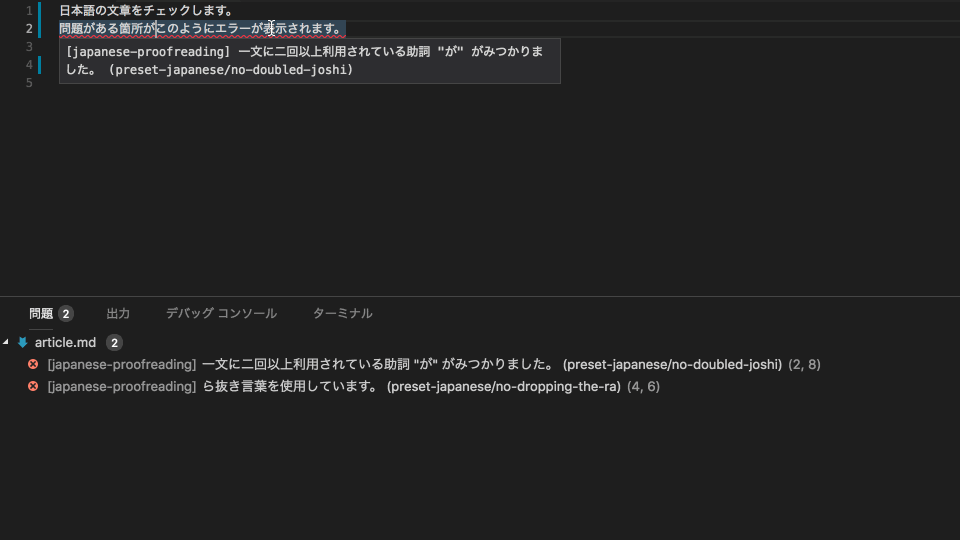

# テキスト校正くん

VSCode上でテキストファイルまたはMarkdownファイルの日本語の文章をチェックする拡張機能です。該当のファイルを開いた時、更新した時に自動で校正のチェックを行い、文章内の問題のある箇所をマーキングし問題パネルにエラー内容を表示します。

メールの文章を作成する際やブログ記事の文章を作成する際などに、ご使用いただくと便利です。

ウェブ業界の専門用語を含め、一般的な文章のルールに沿って主に以下のようなチェックを行います。

- 「ですます」調と「である」調の混在
- ら抜き言葉
- 二重否定
- 同じ助詞の連続使用
- 同じ接続詞の連続使用
- 逆接の接続助詞「が」の連続使用
- 全角と半角アルファベットの混在
- 弱い日本語表現の利用（〜かもしれない）
- 読点の数（1文に4つまで）
- ウェブの用語や名称の表記統一（Javascript→JavaScript、Github→GitHub等）
- 漢字の閉じ方、開き方（下さい→ください、出来る→できる等）

## 使い方

拡張機能のインストール後、テキストファイル（.txt）またはMarkdownファイル（.md）を開くと自動で文章のチェックが行われ、問題パネルに指摘内容が表示されます。問題パネルが表示されていない場合は、ステータスバーの左下にあるアイコンをクリックし、問題パネルを表示してください。

問題パネルには、指摘内容と該当箇所（何行目の何文字目で発生しているか）の情報が表示されます。指摘内容をダブルクリックすることで該当箇所へカーソルを移動できるため、そのまま修正が可能です。リアルタイムでチェックを行っているため、該当箇所の修正を行うと、エラーが消えます。
